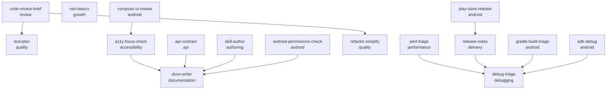

# Skill graph

Edges point from a skill to skills it hands work to. Generated by `npm run graph`.

```mermaid
graph TD
  code-review-brief["code-review-brief<br/>review"]
  test-plan["test-plan<br/>quality"]
  perf-triage["perf-triage<br/>performance"]
  a11y-focus-check["a11y-focus-check<br/>accessibility"]
  release-notes["release-notes<br/>delivery"]
  debug-triage["debug-triage<br/>debugging"]
  api-contract["api-contract<br/>api"]
  docs-writer["docs-writer<br/>documentation"]
  refactor-simplify["refactor-simplify<br/>quality"]
  skill-author["skill-author<br/>authoring"]
  seo-basics["seo-basics<br/>growth"]
  gradle-build-triage["gradle-build-triage<br/>android"]
  compose-ui-review["compose-ui-review<br/>android"]
  adb-debug["adb-debug<br/>android"]
  play-store-release["play-store-release<br/>android"]
  android-permissions-check["android-permissions-check<br/>android"]
  code-review-brief --> refactor-simplify
  code-review-brief --> test-plan
  perf-triage --> debug-triage
  a11y-focus-check --> docs-writer
  release-notes --> debug-triage
  api-contract --> docs-writer
  skill-author --> docs-writer
  gradle-build-triage --> debug-triage
  compose-ui-review --> a11y-focus-check
  adb-debug --> debug-triage
  play-store-release --> release-notes
  android-permissions-check --> docs-writer
```

## Cycles

None found.
